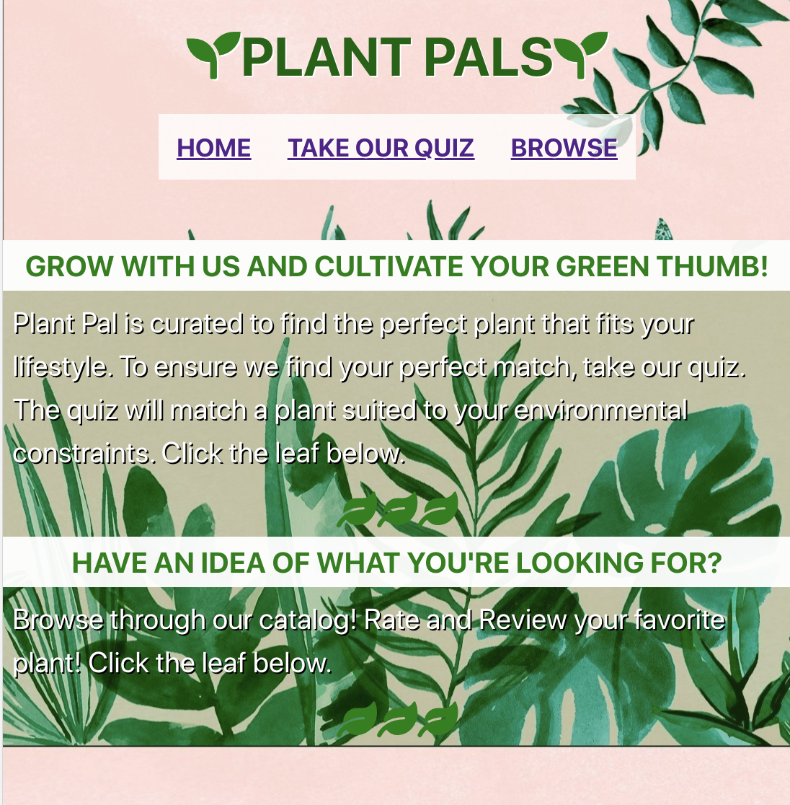

# plant-pals
Welcome To Plant Pals!

Live Link: https://plant-pal.now.sh/

Summary: 

The purpose of this application is to assist the user find an indoor plant based on their needs and other users' experiences. 
The user is able to browse through a directory of indoor plants where basic a summary of each plant is listed. The user may also read and leave reviews!
A short quiz is also implemented as a tool for users to find a quick plant match. 

Technologies used: React, CSS, Node, Express, and PostgreSQL.

